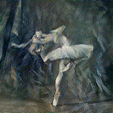
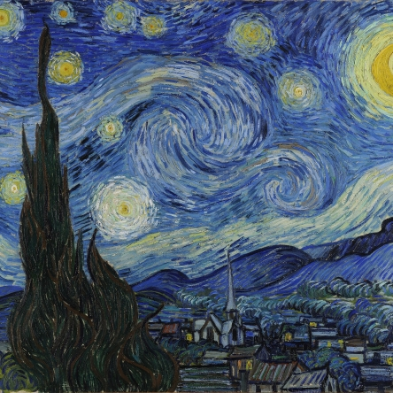
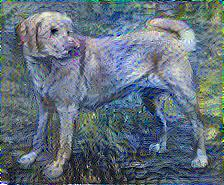

# Neural Style Transfer using TensorFlow

This project implements **Neural Style Transfer (NST)** using a pre-trained VGG19 network. NST transfers the style of one image onto another while preserving the content of the original image. The model extracts content and style features from images and iteratively updates a target image to match these features.

## Project Structure

- `nst.py`: Main script to run the style transfer process.
- `helper.py`: Utility functions for image processing, Gram matrix computation, and image clipping.
- `config.py`: Configuration for defining content and style layers, as well as their respective weights in the loss function.
- `model.py`: Defines the feature extractor model based on VGG19 and computes the style/content loss.
- `util.py`: Contains helper functions to load, preprocess, and display images.

## Outputs

| Content Image                                                           | Style Image                                                          | Output Image                               |
| ----------------------------------------------------------------------- | -------------------------------------------------------------------- | ------------------------------------------ |
|   |   |    |
|  |  |  |


## Running the Project

### 1. Clone the Repository

First, clone the repository to your local machine:

```bash
git clone https://github.com/sd8capricon/neural-style-transfer.git
cd neural-style-transfer
```

### 2. Install Dependencies 

```bash
# Create a virtual environment (optional)
python -m venv venv
# Activate the virtual environment
# On Windows
venv\Scripts\activate
# On macOS/Linux
source venv/bin/activate

# Install the required packages
pip install -r requirements.txt
```

### 3. Prepare Images

Save your content and style images in the images/content/ and images/styles/ directories, respectively.

### 4. Run the Style Tranfer

Run the nst.py script to generate the stylized image:
```bash
python nst.py
```

## Reference:

A Neural Algorithm of Artistic Style.\
Leon A. Gatys, Alexander S. Ecker, Matthias Bethge (2015).\
*arXiv*. [https://doi.org/10.48550/arXiv.1508.06576](https://doi.org/10.48550/arXiv.1508.06576)
